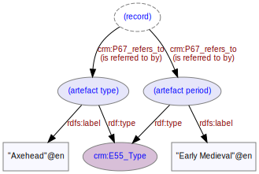

# Artefact
***

Artefacts are objects of some interest found on a [site](ld4he-site.md) during an [investigation](ld4he-investigation.md). Artefact types are concepts from the object type thesaurus corresponding to the location of the [site](ld4he-site.md). For England & Wales this will be the [FISH Archaeological Objects Thesaurus](http://purl.org/heritagedata/schemes/mda_obj), for Scotland it will be the [HES Archaeological Objects Thesaurus](http://purl.org/heritagedata/schemes/2).
 


**Fig. 1:** Artefact with associated entities and properties

```turtle
{!ttl/example-artefact.ttl!}
```
**Fig. 2:** [Turtle RDF](https://www.w3.org/TR/turtle/) syntax example

[Turtle styled](https://cdn.rawgit.com/niklasl/ldtr/v0.2.2/demo/?url=./ttl/example-artefact.ttl&edit=true)