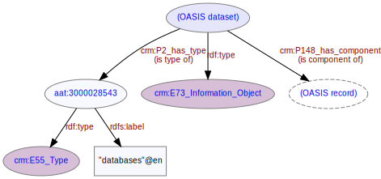

# Dataset
***
The entire OASIS dataset of metadata. The dataset is composed of [records](ld4he-record.md).
 


```turtle
@prefix rdf: <http://www.w3.org/1999/02/22-rdf-syntax-ns#> .
@prefix rdfs: <http://www.w3.org/2000/01/rdf-schema#> .
@prefix crm: <http://www.cidoc-crm.org/cidoc-crm/> .
@prefix aat: <http://vocab.getty.edu/aat/> .

<http://tempuri/dataset/1> a crm:E73_Information_Object ;
   crm:P148_has_component <http://tempuri/record/1> ;
   crm:P2_has_type aat:300028543 .
<http://tempuri/record/1> a crm:E73_Information_Object ;
   crm:P148i_is_component_of <http://tempuri/dataset/1> .  
aat:300028543 a crm:E55_Type ;
   rdfs:label "databases"@en .
```
