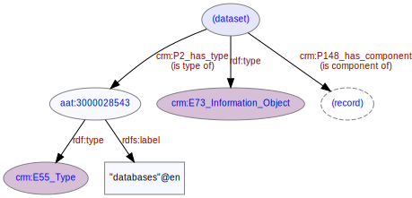

# Dataset
***
The dataset is composed of a number of [records](ld4he-record.md).
 


**Fig. 1:** Dataset with associated entities and properties | [svg](img/ld4he-dataset.svg) | [png](img/ld4he-dataset.png) | [pdf](img/ld4he-dataset.pdf)

```turtle
{!ttl/example-dataset.ttl!}
```
**Fig. 2:** [Turtle RDF](https://www.w3.org/TR/turtle/) example | [raw](ttl/example-dataset.ttl) | [styled](https://cdn.rawgit.com/niklasl/ldtr/v0.2.2/demo/?url=https://cbinding.github.io/LD4HE/ttl/example-dataset.ttl)
