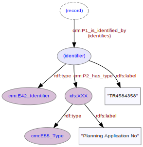

# Identifier
***

A [record](ld4he-record.md) describing an [investigation](ld4he-investigation.md) on a [site](ld4he-site.md) may be associated with multiple identifiers. The identifier will be of a specific type. Identifier types are concept URIs from the [OASIS Associated ID list](http://purl.org/heritagedata/schemes/2fedf061-855a-482c-9bc9-e7629bfc37ad). 
 


**Fig. 1:** Identifiers for a site record | [svg](img/ld4he-identifier.svg) | [png](img/ld4he-identifier.png) | [pdf](img/ld4he-identifier.pdf)

```turtle
{!ttl/example-identifier.ttl!}
```
**Fig. 2:** [Turtle RDF](https://www.w3.org/TR/turtle/) example | [raw](ttl/example-identifier.ttl) | [styled](https://cdn.rawgit.com/niklasl/ldtr/v0.2.2/demo/?url=https://cbinding.github.io/LD4HE/ttl/example-identifier.ttl)

