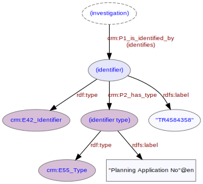

# Investigation Identifier
***

An [investigation](ld4he-investigation.md) may be associated with one or more identifiers, for example a planning application identifier associated with the project.
 


**Fig. 1:** planning application identifier associated with an investigation | [svg](img/ld4he-investigation-identifier.svg) | [png](img/ld4he-investigation-identifier.png) | [pdf](img/ld4he-investigation-identifier.pdf)

```turtle
{!ttl/example-investigation-identifier.ttl!}
```
**Fig. 2:** [Turtle RDF](https://www.w3.org/TR/turtle/) example | [raw](ttl/example-investigation-identifier.ttl) | [styled](https://cdn.rawgit.com/niklasl/ldtr/v0.2.2/demo/?url=https://cbinding.github.io/LD4HE/ttl/example-investigation-identifier.ttl)
