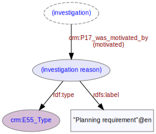

# Reason for investigation
***

There will ordinarily be an explicitly stated reason behind any [investigation](ld4he-investigation.md) activity on a [site](ld4he-site.md). The reason is described using one or more concept URIs from the [OASIS Reason for Investigation](http://purl.org/heritagedata/schemes/ee833bdc-4cf1-4fbf-9282-29e75655855d) thesaurus. Examples of reasons for investigation might be [Planning requirements](http://purl.org/heritagedata/schemes/ee833bdc-4cf1-4fbf-9282-29e75655855d/concepts/11e58ff4-9432-4452-a364-6b22e1696944), [Assessment for designation](http://purl.org/heritagedata/schemes/ee833bdc-4cf1-4fbf-9282-29e75655855d/concepts/e2ebd0a4-8fe7-4cec-b5a0-977baff7b42c), [Academic research](http://purl.org/heritagedata/schemes/ee833bdc-4cf1-4fbf-9282-29e75655855d/concepts/ef4a9489-1107-4d9c-8f76-bd65b2da9a51) etc.
 


**Fig. 1:** Reason for investigation on a site | [svg](img/ld4he-investigation-reason.svg) | [png](img/ld4he-investigation-reason.png) | [pdf](img/ld4he-investigation-reason.pdf)

```turtle
{!ttl/example-investigation-reason.ttl!}
```
**Fig. 2:** [Turtle RDF](https://www.w3.org/TR/turtle/) example 
| [styled](https://cdn.rawgit.com/niklasl/ldtr/v0.2.2/demo/?url=https://cbinding.github.io/LD4HE/ttl/example-investigation-reason.ttl)
| [RDFa](http://rdf-translator.appspot.com/convert/n3/rdfa/html/https://cbinding.github.io/LD4HE/ttl/example-investigation-reason.ttl)
| [microdata](http://rdf-translator.appspot.com/convert/n3/microdata/html/https://cbinding.github.io/LD4HE/ttl/example-investigation-reason.ttl)
| [xml](http://rdf-translator.appspot.com/convert/n3/xml/html/https://cbinding.github.io/LD4HE/ttl/example-investigation-reason.ttl) 
| [nt](http://rdf-translator.appspot.com/convert/n3/nt/html/https://cbinding.github.io/LD4HE/ttl/example-investigation-reason.ttl)
| [json-ld](http://rdf-translator.appspot.com/convert/n3/json-ld/html/https://cbinding.github.io/LD4HE/ttl/example-investigation-reason.ttl)
