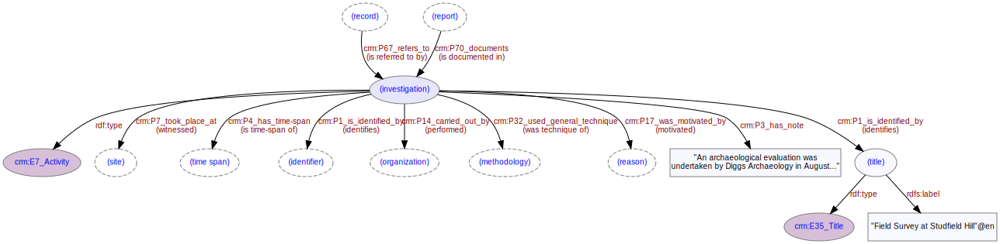

# Investigation
***

Investigative activity taking place on a [site](ld4he-site.md) is carried out by an [organization](ld4he-organization.md) during a specific [time-span](ld4he-timespan.md).
 


**Fig. 1:** Investigation with associated entities and properties

```turtle
@prefix rdfs: <http://www.w3.org/2000/01/rdf-schema#> .
@prefix crm: <http://www.cidoc-crm.org/cidoc-crm/> .
@prefix aat: <http://vocab.getty.edu/aat/> .

<http://tempuri/investigation/1> a crm:E7_Activity ;
   crm:P67i_is_referred_to_by <http://tempuri/record/1> ;
   crm:P2_has_type aat:300053702 ;
   crm:P17_was_motivated_by <http://tempuri/reason/1> ;
   crm:P14_carried_out_by <http://tempuri/organization/1> ;
   crm:P4_has_time-span <http://tempuri/timespan/1> ;
   crm:P7_took_place_at <http://tempuri/site/1> .
<http://tempuri/record/1> a crm:E73_Information_Object ;
   crm:P67_refers_to <http://tempuri/investigation/1> .
aat:300053702 a crm:E55_Type ;
   crm:P2i_is_type_of <http://tempuri/investigation/1> ;
   rdfs:label "excavation (process)"@en .
<http://tempuri/reason/1> a crm:E55_Type ;
   crm:P17i_motivated <http://tempuri/investigation/1> ;
   rdfs:label "planning requirement"@en .
<http://tempuri/organization/1> a crm:E74_Group ;
   crm:P14i_performed <http://tempuri/investigation/1> .
<http://tempuri/timespan/1> a crm:E52_Time-Span ;
   crm:P4i_is_time-span_of <http://tempuri/investigation/1> .
<http://tempuri/site/1> a crm:E53_Place ;
   crm:P7i_witnessed <http://tempuri/investigation/1> .
```
**Fig. 2:** [Turtle RDF](https://www.w3.org/TR/turtle/) syntax example