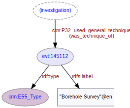

# Investigation Methodology
***

An [investigation](ld4he-investigation.md) on a [site](ld4he-site.md) may involve the use of a methodology (an investigative technique). The methodology used is described using a concept URI originating from the [FISH Event Types Thesaurus](http://purl.org/heritagedata/schemes/agl_et). Examples of investigation methodology might be [Borehole Survey](http://purl.org/heritagedata/schemes/agl_et/concepts/145112), [Timber Sampling](http://purl.org/heritagedata/schemes/agl_et/concepts/145173), [Rescue Excavation](http://purl.org/heritagedata/schemes/agl_et/concepts/145157) etc.
 


**Fig. 1:** Methodology used in an investigation | [svg](img/ld4he-methodology.svg) | [png](img/ld4he-methodology.png) | [pdf](img/ld4he-methodology.pdf)

```turtle
{!ttl/example-methodology.ttl!}
```
**Fig. 2:** [Turtle RDF](https://www.w3.org/TR/turtle/) example | [raw](ttl/example-methodology.ttl) | [styled](https://cdn.rawgit.com/niklasl/ldtr/v0.2.2/demo/?url=https://cbinding.github.io/LD4HE/ttl/example-methodology.ttl)

