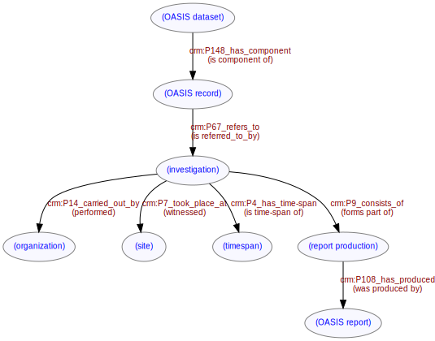

# Data Model
***

The [dataset](ld4he-dataset.md) is composed of a [records](ld4he-record.md) referring to [investigations](ld4he-investigation.md). Investigations are carried out by [organizations](ld4he-organization.md) at [sites](ld4he-site.md) during [time-spans](ld4he-timespan.md). Investigations encompass many activities, including [report](ld4he-report.md) production.



```turtle
@prefix rdf: <http://www.w3.org/1999/02/22-rdf-syntax-ns#> .
@prefix rdfs: <http://www.w3.org/2000/01/rdf-schema#> .
@prefix crm: <http://www.cidoc-crm.org/cidoc-crm/> .
@prefix aat: <http://vocab.getty.edu/aat/> .

<http://tempuri/dataset/1> crm:P148_has_component <http://tempuri/record/1> .
<http://tempuri/record/1> crm:P148i_is_component_of <http://tempuri/dataset/1> ;
   crm:P67_refers_to <http://tempuri/investigation/1> .
<http://tempuri/investigation/1> crm:P14-carried_out_by <http://tempuri/organization/1> ;
   crm:P7_took_place_at <http://tempuri/site/1> ;
   crm:P9_consists_of <http://tempuri/reportproduction/1> ;
   crm:P108_has_produced <http://tempuri/report/1> ;
   crm:P4_has_time-span <http://tempuri/timespan/1> .
<http://tempuri/organization/1> crm:P14i_performed <http://tempuri/investigation/1> .
<http://tempuri/site/1> crm:P7i_witnessed <http://tempuri/investigation/1> .
<http://tempuri/reportproduction/1> crm:P9i_forms_part_of <http://tempuri/investigation/1> ;
   crm:P108_has_produced <http://tempuri/report/1> .
<http://tempuri/report/1> crm:P108i_was_produced_by <http://tempuri/reportproduction/1> .
<http://tempuri/timespan/1> crm:P4i_is_time-span_of <http://tempuri/investigation/1> . 
```
