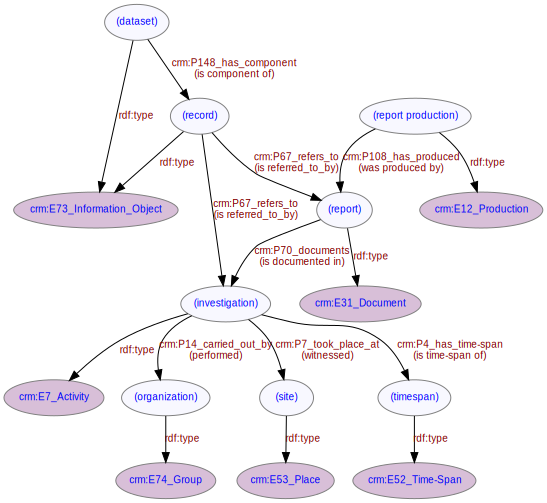

# Data Model Overview
***
The LD4HE data model is based on a subset of the [CIDOC Conceptual Reference Model (CRM)](http://www.cidoc-crm.org/). The following pages give further details of distinct aspects of the LD4HE data model:

* [Dataset](ld4he-dataset.md)
	* [Record](ld4he-record.md)  
	* [Record identifier](ld4he-identifier.md)  
* [Investigation](ld4he-investigation.md)
	* [Investigation identifier](ld4he-investigation-identifier.md)
	* [Investigation reason](ld4he-investigation-reason.md)
	* [Investigation methodology](ld4he-methodology.md)	
* [Site](ld4he-site.md)
	* [Site name](ld4he-site-name.md)
	* [Site location](ld4he-site-location.md)		
* [Report](ld4he-report.md)
	* [Report identifier](ld4he-report-identifier.md)
	* [Report production](ld4he-report-production.md)
	* [Report publication](ld4he-report-publication.md)
* [Time Span](ld4he-timespan.md)  
* [Artefact](ld4he-artefact.md)
* [Monument](ld4he-monument.md)
* [Organization](ld4he-organization.md)	
	* [Organization name](ld4he-organization-name.md)	
* [Person](ld4he-person.md)  

Figure 1 below gives an indication of how each of these aspects are interlinked in the overall model. The [dataset](ld4he-dataset.md) is composed of [records](ld4he-record.md) referring to [investigations](ld4he-investigation.md). Investigations are carried out by [organizations](ld4he-organization.md) at [sites](ld4he-site.md) during [time-spans](ld4he-timespan.md). [Report production](ld4he-report-production.md) produces [reports](ld4he-report.md) that document the [investigations](ld4he-investigation.md).



**Fig. 1:** Main entities and properties | [svg](img/ld4he-main-model.svg) | [png](img/ld4he-main-model.png) | [pdf](img/ld4he-main-model.pdf)

```turtle
{!ttl/example-overall.ttl!}
```
**Fig. 2:** [Turtle RDF](https://www.w3.org/TR/turtle/) example | [raw](ttl/example-overall.ttl) | [styled](https://cdn.rawgit.com/niklasl/ldtr/v0.2.2/demo/?url=https://cbinding.github.io/LD4HE/ttl/example-overall.ttl)
