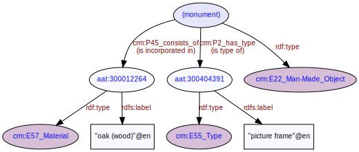

# Monument
***

Monuments are larger immovable structures identified as being of some interest to archaeological activities. In a similar approach to [artefacts](ld4he-artefact.md), Specific instances of monuments are not included in OASIS metadata [records](ld4he-record.md) - instead the records refer to general monument types (and monument periods). Monument types are concepts originating from the monument types thesaurus corresponding to the location of the [site](ld4he-site.md). For England this will be the [	FISH Thesaurus of Monument Types](http://purl.org/heritagedata/schemes/eh_tmt2), for Scotland it will be the [Monument Type Thesaurus (Scotland)](http://purl.org/heritagedata/schemes/1) and for Wales it will be the [MONUMENT TYPE (WALES)](http://purl.org/heritagedata/schemes/10) thesaurus. Where records refer to monument periods these will be concepts originating from the appropriate periods list corresponding to the location of the site. For England this will be the [Historic England Periods List](http://purl.org/heritagedata/schemes/eh_period), for Scotland it will (possibly) be [ScAPA : Scottish Archaeological Periods & Ages](http://purl.org/heritagedata/schemes/scapa) and for Wales it will be [PERIOD (WALES)](http://purl.org/heritagedata/schemes/11). There is no direct connection between the monument type and the period concept in the dataset record, but the concepts are nevertheless useful for searching on records referring to controlled vocabulary terms e.g. "Early Medieval" or "Lime Kiln".
 


**Fig. 1:** Monument type and period associated with a site record | [svg](img/ld4he-monument.svg) | [png](img/ld4he-monument.png) | [pdf](img/ld4he-monument.pdf)

```turtle
{!ttl/example-monument.ttl!}
```
**Fig. 2:** [Turtle RDF](https://www.w3.org/TR/turtle/) example 
| [styled](https://cdn.rawgit.com/niklasl/ldtr/v0.2.2/demo/?url=https://cbinding.github.io/LD4HE/ttl/example-monument.ttl)
| [RDFa](http://rdf-translator.appspot.com/convert/n3/rdfa/html/https://cbinding.github.io/LD4HE/ttl/example-monument.ttl)
| [microdata](http://rdf-translator.appspot.com/convert/n3/microdata/html/https://cbinding.github.io/LD4HE/ttl/example-monument.ttl)
| [xml](http://rdf-translator.appspot.com/convert/n3/xml/html/https://cbinding.github.io/LD4HE/ttl/example-monument.ttl) 
| [nt](http://rdf-translator.appspot.com/convert/n3/nt/html/https://cbinding.github.io/LD4HE/ttl/example-monument.ttl)
| [json-ld](http://rdf-translator.appspot.com/convert/n3/json-ld/html/https://cbinding.github.io/LD4HE/ttl/example-monument.ttl)
