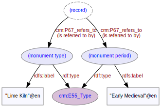

# Monument
***

Monuments are larger (immovable) objects found on a [site](ld4he-site.md) during an [investigation](ld4he-investigation.md)
Monument types are concepts from the [FISH Thesaurus of Monument Types](http://purl.org/heritagedata/schemes/eh_tmt2)
 


```turtle
@prefix rdf: <http://www.w3.org/1999/02/22-rdf-syntax-ns#> .
@prefix rdfs: <http://www.w3.org/2000/01/rdf-schema#> .
@prefix crm: <http://www.cidoc-crm.org/cidoc-crm/> .
@prefix aat: <http://vocab.getty.edu/aat/> .

<http://tempuri/monument/1> a crm:E22_Man-Made_Object ;
   crm:P2_has_type <http://purl.org/heritagedata/schemes/eh_tmt2/concepts/69063> ;
<http://purl.org/heritagedata/schemes/eh_tmt2/concepts/69063> crm:P2i_is_type_of <http://tempuri/monument/1> ;
   rdfs:label "lime kiln"@en .
```
