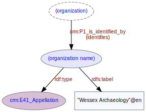

# Organization Name
***

An [organization](ld4he-organization.md) is identified by a name. This name is not guaranteed to be unique so should not be relied on as a unique identifier.
 


**Fig. 1:** Organization name | [svg](img/ld4he-organization-name.svg) | [png](img/ld4he-organization-name.png) | [pdf](img/ld4he-organization-name.pdf)

Examples of organization names are "Archaeology Data Service", "Wessex Archaeology", "Historic Environment Scotland" etc.

```turtle
{!ttl/example-organization-name.ttl!}
```
**Fig. 2:** [Turtle RDF](https://www.w3.org/TR/turtle/) example | [raw](ttl/example-organization-name.ttl) | [styled](https://cdn.rawgit.com/niklasl/ldtr/v0.2.2/demo/?url=https://cbinding.github.io/LD4HE/ttl/example-organization-name.ttl)
