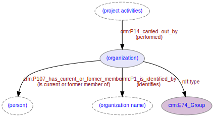

# Organization
***

An organization is any group involved in activities described in the data - such as [investigations](ld4he-investigation.md). 
 


**Fig. 1:** Organization with associated entities and properties

Examples of organizations are contractors, HERs (or other national bodies), local authorities, data aggregators, report authors, report publishers etc.

```turtle
{!ttl/example-organization.ttl!}
```
**Fig. 2:** [Turtle RDF](https://www.w3.org/TR/turtle/) example | [raw](https://cbinding.github.io/LD4HE/ttl/example-organization.ttl) | [styled](https://cdn.rawgit.com/niklasl/ldtr/v0.2.2/demo/?url=https://cbinding.github.io/LD4HE/ttl/example-organization.ttl)
