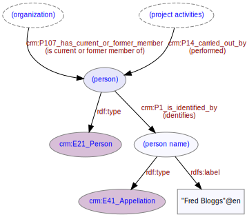

# Person
***

A person is a member of an [organization](ld4he-organization.md) involved in undertaking project activities such as [investigations](ld4he-investigation.md). 
 


```turtle
@prefix rdf: <http://www.w3.org/1999/02/22-rdf-syntax-ns#> .
@prefix rdfs: <http://www.w3.org/2000/01/rdf-schema#> .
@prefix crm: <http://www.cidoc-crm.org/cidoc-crm/> .
@prefix aat: <http://vocab.getty.edu/aat/> .

<http://tempuri/organization/1> a crm:E74_Group ;
   crm:P107_has_current_or_former_member <http://tempuri/person/1> .
<http://tempuri/person/1> a crm:E21_Person ;
   crm:P107i_is_current_or_former_member_of <http://tempuri/organization/1> ;
   crm:P1_is_identified_by <http://tempuri/personname/1> .
<http://tempuri/personnname/1> a crm:E41_Appellation ;
   rdfs:label "Fred Bloggs"@en .
```
