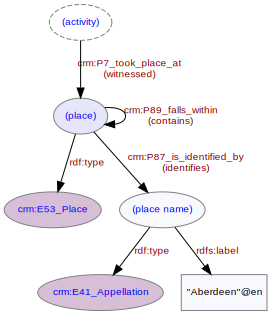

# Place
***

A named location associated with some aspect of the [investigative activities](ld4he-investigation.md). For example [report publication](ld4he-report-publication.md) will usually name the place of publication (e.g. "Aberdeen"). An [investigation](ld4he-investigation.md) takes place on a [site](ld4he-site.md) (which is itself a named place) - the site will then fall within a broader named place (e.g. "Aberdeen"). A place may be known by more than one name, possibly in more than one language (e.g. "Cardiff"@en, "Caerdydd"@cy).
  


**Fig. 1:** Place with associated entities and properties | [svg](img/ld4he-place.svg) | [png](img/ld4he-place.png) | [pdf](img/ld4he-place.pdf)

```turtle
{!ttl/example-place.ttl!}
```
**Fig. 2:** [Turtle RDF](https://www.w3.org/TR/turtle/) example | [raw](ttl/example-place.ttl) | [styled](https://cdn.rawgit.com/niklasl/ldtr/v0.2.2/demo/?url=https://cbinding.github.io/LD4HE/ttl/example-place.ttl)
