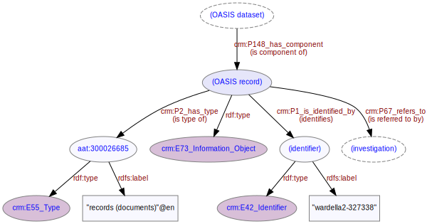

# Record
***

A single OASIS record, a component of the full OASIS [dataset](ld4he-dataset.md). OASIS records refer to [investigations](ld4he-investigation.md)
 


```turtle
@prefix rdf: <http://www.w3.org/1999/02/22-rdf-syntax-ns#> .
@prefix rdfs: <http://www.w3.org/2000/01/rdf-schema#> .
@prefix crm: <http://www.cidoc-crm.org/cidoc-crm/> .
@prefix aat: <http://vocab.getty.edu/aat/> .

<http://tempuri/dataset/1> a crm:E73_Information_Object ;
   crm:P148_has_component <http://tempuri/record/1> .
<http://tempuri/record/1> a crm:E73_Information_Object ;
   crm:P148i_is_component_of <http://tempuri/dataset/1> ;
   crm:P2_has_type aat:300026685 ;
   crm:P1_is_identified_by <http://tempuri/recordidentifier/1> ;
   crm:P67_refers_to <http://tempuri/investigation/1> ,  
aat:300026685 a crm:E55_Type ;
   crm:P2i_is_type_of <http://tempuri/record/1> ;
   rdfs:label "records (documents)"@en .
<http://tempuri/recordidentifier/1> a crm:E42_Identifier ;
   crm:P1i_identifies <http://tempuri/record/1> ;
   rdfs:label "wardella2-327338" .   
```
