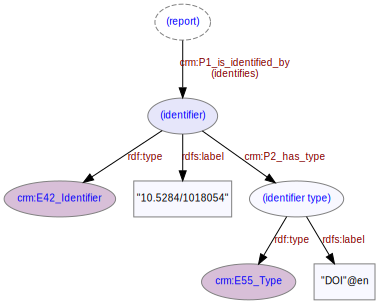

# Report Identifier
***

A [report](ld4he-report.md) may be associated with one or more identifiers, for example a DOI or a URI.
 


**Fig. 1:** identifier associated with a report | [svg](img/ld4he-report-identifier.svg) | [png](img/ld4he-report-identifier.png) | [pdf](img/ld4he-report-identifier.pdf)

```turtle
{!ttl/example-report-identifier.ttl!}
```
**Fig. 2:** [Turtle RDF](https://www.w3.org/TR/turtle/) example 
| [styled](https://cdn.rawgit.com/niklasl/ldtr/v0.2.2/demo/?url=https://cbinding.github.io/LD4HE/ttl/example-report-identifier.ttl)
| [RDFa](http://rdf-translator.appspot.com/convert/n3/rdfa/html/https://cbinding.github.io/LD4HE/ttl/example-report-identifier.ttl)
| [microdata](http://rdf-translator.appspot.com/convert/n3/microdata/html/https://cbinding.github.io/LD4HE/ttl/example-report-identifier.ttl)
| [xml](http://rdf-translator.appspot.com/convert/n3/xml/html/https://cbinding.github.io/LD4HE/ttl/example-report-identifier.ttl) 
| [nt](http://rdf-translator.appspot.com/convert/n3/nt/html/https://cbinding.github.io/LD4HE/ttl/example-report-identifier.ttl)
| [json-ld](http://rdf-translator.appspot.com/convert/n3/json-ld/html/https://cbinding.github.io/LD4HE/ttl/example-report-identifier.ttl)
