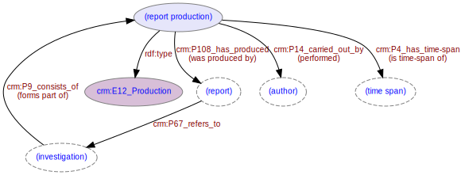

# Report Production
***

Report production is the activity by an [author](ld4he-person.md) of producing a [report](ld4he-report.md) as part of an [investigation](ld4he-investigation.md). Report production and [publication](ld4he-report-publication.md) activities both have an associated [time-span](ld4he-timespan.md) 
  


**Fig. 1:** Report production with associated entities and properties | [svg](img/ld4he-report-production.svg) | [png](img/ld4he-report-production.png) | [pdf](img/ld4he-report-production.pdf)

```turtle
{!ttl/example-report-production.ttl!}
```
**Fig. 2:** [Turtle RDF](https://www.w3.org/TR/turtle/) example 
| [styled](https://cdn.rawgit.com/niklasl/ldtr/v0.2.2/demo/?url=https://cbinding.github.io/LD4HE/ttl/example-report-production.ttl)
| [RDFa](http://rdf-translator.appspot.com/convert/n3/rdfa/html/https://cbinding.github.io/LD4HE/ttl/example-report-production.ttl)
| [microdata](http://rdf-translator.appspot.com/convert/n3/microdata/html/https://cbinding.github.io/LD4HE/ttl/example-report-production.ttl)
| [xml](http://rdf-translator.appspot.com/convert/n3/xml/html/https://cbinding.github.io/LD4HE/ttl/example-report-production.ttl) 
| [nt](http://rdf-translator.appspot.com/convert/n3/nt/html/https://cbinding.github.io/LD4HE/ttl/example-report-production.ttl)
| [json-ld](http://rdf-translator.appspot.com/convert/n3/json-ld/html/https://cbinding.github.io/LD4HE/ttl/example-report-production.ttl)
