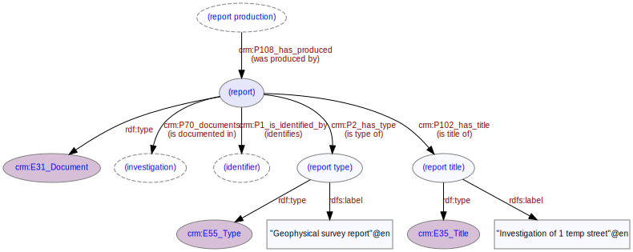

# Report
***

A report is a document describing some aspect of an [investigation](ld4he-investigation.md). One or more reports may be [produced](ld4he-report-production.md) either during or following an investigation. A report usually has an associated [identifier](ld4he-report-identifier.md). Report types are concepts from the [OASIS Digital Paper and Archive Component](http://purl.org/heritagedata/schemes/c31949b0-b6cf-4223-a2c0-c9a2048633ff) thesaurus - examples of report types are ["Geophysical survey report"](http://purl.org/heritagedata/schemes/c31949b0-b6cf-4223-a2c0-c9a2048633ff/concepts/a8554064-858c-4b75-b570-e37643bbfaaa), ["Scientific dating report"](http://purl.org/heritagedata/schemes/c31949b0-b6cf-4223-a2c0-c9a2048633ff/concepts/38bd0ad4-717e-4f1a-98a7-4ed3110d8c2c), ["Watching brief report"](http://purl.org/heritagedata/schemes/c31949b0-b6cf-4223-a2c0-c9a2048633ff/concepts/d38d0e6f-b97b-4925-a238-fd502d21d396) etc.



**Fig. 1:** Report with associated entities and properties | [svg](img/ld4he-report.svg) | [png](img/ld4he-report.png) | [pdf](img/ld4he-report.pdf)

```turtle
{!ttl/example-report.ttl!}
```
**Fig. 2:** [Turtle RDF](https://www.w3.org/TR/turtle/) example 
| [styled](https://cdn.rawgit.com/niklasl/ldtr/v0.2.2/demo/?url=https://cbinding.github.io/LD4HE/ttl/example-report.ttl)
| [RDFa](http://rdf-translator.appspot.com/convert/n3/rdfa/html/https://cbinding.github.io/LD4HE/ttl/example-report.ttl)
| [microdata](http://rdf-translator.appspot.com/convert/n3/microdata/html/https://cbinding.github.io/LD4HE/ttl/example-report.ttl)
| [xml](http://rdf-translator.appspot.com/convert/n3/xml/html/https://cbinding.github.io/LD4HE/ttl/example-report.ttl) 
| [nt](http://rdf-translator.appspot.com/convert/n3/nt/html/https://cbinding.github.io/LD4HE/ttl/example-report.ttl)
| [json-ld](http://rdf-translator.appspot.com/convert/n3/json-ld/html/https://cbinding.github.io/LD4HE/ttl/example-report.ttl)
