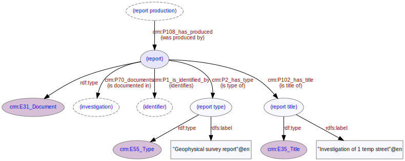

# Report
***

A report may be produced as part of an [investigation](ld4he-investigation.md). Report types are concepts from the [OASIS Digital Paper and Archive Component](http://purl.org/heritagedata/schemes/c31949b0-b6cf-4223-a2c0-c9a2048633ff) thesaurus.
 


**Fig. 1:** Report with associated entities and properties

```turtle
@prefix rdfs: <http://www.w3.org/2000/01/rdf-schema#> .
@prefix crm: <http://www.cidoc-crm.org/cidoc-crm/> .
@prefix rtype: <http://purl.org/heritagedata/schemes/c31949b0-b6cf-4223-a2c0-c9a2048633ff/concepts/> .

<http://tempuri/report/1> a crm:E31_Document ;
   crm:P108i_was_produced_by <http://tempuri/reportproduction/1> ;
   crm:P67_refers_to <http://tempuri/investigation/1> ;
   crm:P2_has_type rtype:a8554064-858c-4b75-b570-e37643bbfaaa ;
   crm:P102_has_title <http://tempuri/reporttitle/1> .
<http://tempuri/reportproduction/1> a crm:12_Production ;
   crm:P9i_forms_part_of <http://tempuri/investigation/1> ;
   crm:P108_produced <http://tempuri/report/1> .
<http://tempuri/investigation/1> a crm:E7_Activity ;
   crm:P9_consists_of <http://tempuri/reportproduction/1> ;
   crm:P67i_is_referred_to_by <http://tempuri/report/1> .
rtype:a8554064-858c-4b75-b570-e37643bbfaaa a crm:E55_Type ;
   crm:P2i_is_type_of <http://tempuri/report/1> ;
   rdfs:label "Geophysical survey report"@en .
<http://tempuri/reporttitle/1> a crm:E35_Title ;
   crm:P102i_is_title_of <http://tempuri/report/1> ;
   rdfs:label "Investigation of 1 temp street"@en .
```
**Fig. 2:** [Turtle RDF](https://www.w3.org/TR/turtle/) syntax example