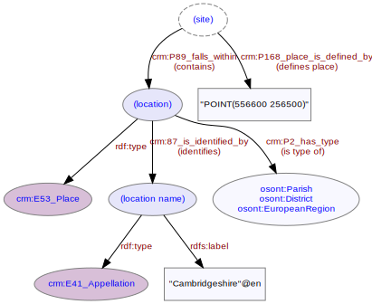

# Site Location
***
Locations and extents of [sites](ld4he-site.md) may be defined in terms of geographic coordinates (OSGB or WGS84) formatted as points or polygons in a single textual field. Examples are "POINT(556600 256500)", "POINT(154350 54350)", "SZ 644 874" etc.

Sites are usually also situated within a known named [place](ld4he-place.md) representing a broader geographical or administrative area (e.g. "Cambridgeshire") - facilitating alternative ways of searching. The OASIS dataset records link sites directly to named places using a flat (as opposed to hierarchical) structure, allowing subsequent searching directly on named places without requiring logical reasoning to allow for possible containment relationships (this also broadly aligns with the way that OS Open Names records are structured) e.g.

* "Country": "England",
* "County": "Cambridgeshire",
* "District/Unitary Authority": "South Cambridgeshire",
* "Parish": "Great Wilbraham"



**Fig. 1:** Site location | [svg](img/ld4he-site-location.svg) | [png](img/ld4he-site-location.png) | [pdf](img/ld4he-site-location.pdf)

```turtle
{!ttl/example-site-location.ttl!}
```
**Fig. 2:** [Turtle RDF](https://www.w3.org/TR/turtle/) example | [raw](ttl/example-site-location.ttl) | [styled](https://cdn.rawgit.com/niklasl/ldtr/v0.2.2/demo/?url=https://cbinding.github.io/LD4HE/ttl/example-site-location.ttl)


