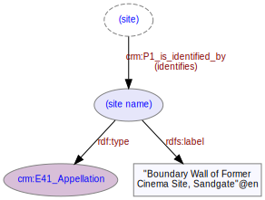

# Site Name
***
[Sites](ld4he-site.md) are usually identified by a local name. This name might not be unique within the dataset, so should not be relied on as a unique identifier.
 


**Fig. 1:** Site name | [svg](img/ld4he-site-name.svg) | [png](img/ld4he-site-name.png) | [pdf](img/ld4he-site-name.pdf)

Examples of site names are "fenchurch", "Studfield Hill", "Boundary Wall of Former Cinema Site, Sandgate" etc.

```turtle
{!ttl/example-site-name.ttl!}
```
**Fig. 2:** [Turtle RDF](https://www.w3.org/TR/turtle/) example | [raw](ttl/example-site-name.ttl) | [styled](https://cdn.rawgit.com/niklasl/ldtr/v0.2.2/demo/?url=https://cbinding.github.io/LD4HE/ttl/example-site-name.ttl)


