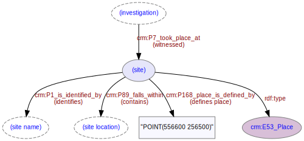

# Site
***
A site represents a location (a place) that is subject to an [investigation](ld4he-investigation.md). Sites are identified by a local [site name](ld4he-site-name.md), often with locations and extents defined in terms of [geographical coordinates](ld4he-site-location.md); sites will usually also fall within a broader named [location](ld4he-site-location.md). 
 


**Fig. 1:** Site with associated entities and properties | [svg](img/ld4he-site.svg) | [png](img/ld4he-site.png) | [pdf](img/ld4he-site.pdf)

```turtle
{!ttl/example-site.ttl!}
```
**Fig. 2:** [Turtle RDF](https://www.w3.org/TR/turtle/) example 
| [styled](https://cdn.rawgit.com/niklasl/ldtr/v0.2.2/demo/?url=https://cbinding.github.io/LD4HE/ttl/example-site.ttl)
| [RDFa](http://rdf-translator.appspot.com/convert/n3/rdfa/html/https://cbinding.github.io/LD4HE/ttl/example-site.ttl)
| [microdata](http://rdf-translator.appspot.com/convert/n3/microdata/html/https://cbinding.github.io/LD4HE/ttl/example-site.ttl)
| [xml](http://rdf-translator.appspot.com/convert/n3/xml/html/https://cbinding.github.io/LD4HE/ttl/example-site.ttl) 
| [nt](http://rdf-translator.appspot.com/convert/n3/nt/html/https://cbinding.github.io/LD4HE/ttl/example-site.ttl)
| [json-ld](http://rdf-translator.appspot.com/convert/n3/json-ld/html/https://cbinding.github.io/LD4HE/ttl/example-site.ttl)
