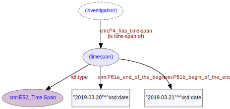

# Time-Span
***

A time-span defines the temporal extent of an activity such as an [investigation](ld4he-investigation.md). Time-spans may also be associated with other activities such as report publication.
 


**Fig. 1:** Time-span with associated entities and properties

```Turtle
{!ttl/example-timespan.ttl!}
```
**Fig. 2:** [Turtle RDF](https://www.w3.org/TR/turtle/) syntax example